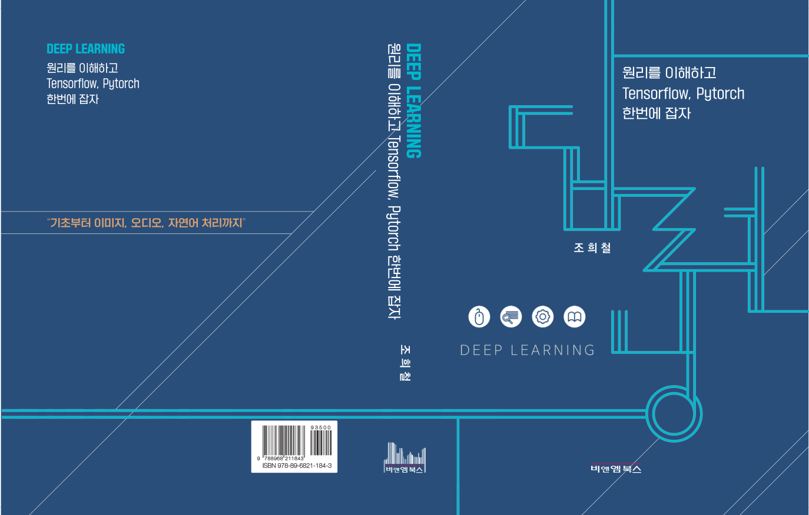

# Deep Learning; 원리를 이해하고 Tensorflow, Pytorch 한번에 잡자

  

Understand Deep Learning principles and master Tensorflow and Pytorch at once

책에 포함된 소스 코드를 Jupyter Notebook 형태로 제공한다.

## 실습 파일 목록
- :football: [DL-TF-TORCH-CH1-Basic.ipynb](https://github.com/hccho2/DL-UPMTP/blob/main/DL-TF-TORCH-CH1-Basic.ipynb)
- :baseball: [DL-TF-TORCH-CH2-3-Regression-DL.ipynb](https://github.com/hccho2/DL-UPMTP/blob/main/DL-TF-TORCH-CH2-3-Regression-DL.ipynb)
- :basketball: [DL-TF-TORCH-CH4-Data-Model.ipynb](https://github.com/hccho2/DL-UPMTP/blob/main/DL-TF-TORCH-CH4-Data-Model.ipynb)
- :golf: [DL-TF-TORCH-CH5-TF-Custom-Training.ipynb](https://github.com/hccho2/DL-UPMTP/blob/main/DL-TF-TORCH-CH5-TF-Custom-Training.ipynb)
- :soccer: [DL-TF-TORCH-CH6-CNN.ipynb](https://github.com/hccho2/DL-UPMTP/blob/main/DL-TF-TORCH-CH6-CNN.ipynb)
- :rugby_football: [DL-TF-TORCH-CH7-Image-Model.ipynb](https://github.com/hccho2/DL-UPMTP/blob/main/DL-TF-TORCH-CH7-Image-Model.ipynb)
- :surfer: [DL-TF-TORCH-CH8-RNN-NLP.ipynb](https://github.com/hccho2/DL-UPMTP/blob/main/DL-TF-TORCH-CH8-RNN-NLP.ipynb)
- :ski: [DL-TF-TORCH-CH8-Huggingface.ipynb](https://github.com/hccho2/DL-UPMTP/blob/main/DL-TF-TORCH-CH8-Huggingface.ipynb)
- :tennis: [DL-TF-TORCH-CH9-Audio.ipynb](https://github.com/hccho2/DL-UPMTP/blob/main/DL-TF-TORCH-CH9-Audio.ipynb)

## Errata(정오표)
오탈자나 수정사항을 Issues로 알려주세요. 반영하겠습니다.
- page 715: xxx
